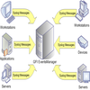

# SYSLOG - Multicog debug/log to SD/Serial

By: Alex Stanfield

Language: Spin

Created: May 15, 2012

Modified: May 2, 2013

Provides a logging/debugging system that can store information from multiple cogs (running SPIN) into one file on a SD card, may optionally echo that information to a serial terminal.

*   Echo to serial port may be turned on/off at run-time.
*   Each cog may have it's own description in the log file for easily finding any given routine's output.
*   Can monitor variables and log their changes (like a "poor man's Viewport"), however as it runs under SPIN it will NOT capture all changes if they occur at high speed.
