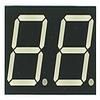

# Seven Segments of Fun LED Driver

By: Tom Talbot

Language: Spin

Created: Apr 16, 2013

Modified: May 20, 2013

Full alphanumeric ASCII 7-segment display driver. Supports 8+ digits and features background animation in 1 separate COG. Features include sequential animation, scrolling, blinking, decimal/hex and more. Hook up of 4 or 8 digit displays is easy.

Supports common cathode, common anode as well as optional dual-multiplexing. Shows all ASCII characters within limits of 7-segments. This is my first object, hope you like it. Includes demo.

**Demo Videos:**  
https://www.youtube.com/watch?v=ldF9tdRy98g&feature=plcp

  
**Demo w/ rotary encoder:**  
https://www.youtube.com/watch?v=CFpCrx45KW0&feature=plcp
