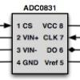

# Simple Driver for ADC0831 A to D Converter

By: D. Hamilton

Language: Spin

Created: Apr 16, 2013

Modified: April 16, 2013

This is a small simple Driver to get the value from an ADC0831 A to D Converter. A demo program that uses the ADC0831 to convert the signal from an LM34 Temperature Sensor is included in the .zip file. The demo also has a nice routine to convert binary variables to numeric (base 10). You can find out more info about the demo here:  
http://forums.parallax.com/forums/default.aspx?f=21&m=431971
