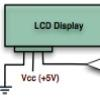

# Simple Driver for Parallax LCD Displays

By: D. Hamilton

Language: Spin

Created: Apr 16, 2013

Modified: April 16, 2013

This a simple Driver for Parallax LCD Displays. It supports the 27979, 27976 and 27977 Displays. Includes methods to turn Back light and Cursor on/off, go to anywhere on the display and clear the display. Also included are methods to display variables in hex, binary and standard numeric (base 10). There is a demo file included in the .zip that uses it. You can find out more info about the demo here:  
http://forums.parallax.com/forums/default.aspx?f=21&m=431971
