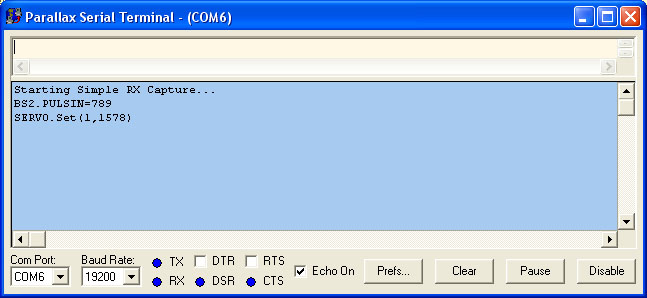

# Simple Radio Control Capture & Repeat to Servo

By: Travis

Language: Spin

Created: Apr 16, 2013

Modified: April 16, 2013

This demo connects a PropStick USB to a radio receiver and a servo. It receives the incoming signal from the radio receiver and re-transmits it to the servo. It outputs the incoming servo position setting and the position being transmitted to the servo to the Parallax Serial Terminal (via FullDuplexSerial).  
It also flashes the LEDs to indicate the program is running.

Note: The output to the servo is a bit jerky. I tried several other Servo control objects from OBEX, but I couldn't figure out the timing relationship between PULSIN and and any other Servo control objects. If you can figure out how to get rid of the jerkiness, please post it in the forum or comments. Thanks!

Objects used:

*   Debug : "FullDuplexSerial" 'standard from propeller library 
*   SERVO : "Servo32v3" 'standard from propeller library

