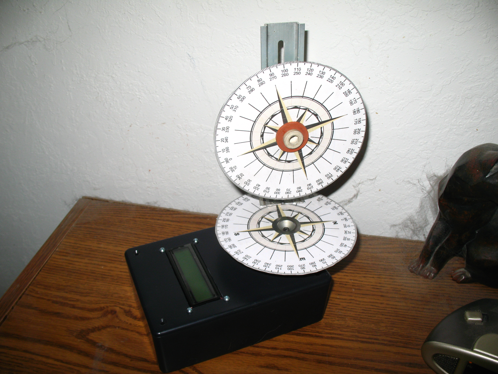

# Solar Position Calculator & Almanac

By: Prophead100

Language: Spin, C

Created: Nov 25, 2011

Modified: May 2, 2013

The solar object calculates a good approximation of the position (altitude and azimuth) and approximate intensity of the sun at any time (local clock or solar) during the day as well as events such as solar noon, sunrise, sunset, twilight(astronomical, nautical, civil), and day length. Derived values such as the equation of time, time meridians, hour angle, day of the year, air mass and declination are also provided. The calculations may also complement sensor based solar tracking by estimating locations during cloudy or semi-shaded conditions or to track to the starting point at sunrise or to set limits of travel based upon angles. This can help optimise movement frequency or reduce errors due to sensor "hunting". The outputs can be used by two axis (azimuth, altitude) or one axis (declination, hour angle) tracking systems. The code can also calculate the altitude and azimuth for a mirror (heliostat) to reflect the sun to a southern target.

The inputs include date, local/solar time,latitude,  
longitude and daylight savings time status. Adjustments are made for value local time zones, daylight savings time, leap year, seasonal tilt of the earth, retrograde of earth rotation, and ecliptic earth orbit (Perihelion, Aphelion) and atmospheric refraction.

"Demo" programs uses the object and 2 servos to (a) provide real time coordinates for aiming a solar collector, (b) aim a heliostat reflector mirror at a target, (c) trace the path over a day, (d) calculate almanac data for a day and (e) scribe a noon time analemma. The almanac which does not use servos is ideal for learning about solar, floating point math and the propeller chip.

Please note: The code is heavily documented and is purposely less compact than possible to be easy to use and allow the user to follow and/or modify the formulas and code. Be sure to check the referenced papers and websites for more equations help. Then feel free to make it more efficient/accurate for your use.

For C Programmers: The attached file Solar\_SPA.zip contains a higher accuracy (+/- 0.0003 degrees) C++ code from NREL that will also run on the Propeller with GCC. However, the XMMC memory model with an SD Card must be used due to the code size. It will take about a minute to run with SPI Flash RAM or about three to four minutes without.

