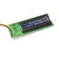

# SparkFun Serial LCD driver

By: Ron Czapala

Language: Spin

Created: Apr 16, 2013

Modified: April 16, 2013

SparkFun\_Serial\_LCD drives the SparkFun line of serial LCDs(SerLCD v2.5) and their Serial Enabled LCD Backpack adapter.

These displays may have 2 or 4 lines and 16 or 20 columns - the "init" method specifies the number of lines and columns.

v1.2 - simplified code
