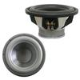

# Speaker Driver

By: Kwabena W. Agyeman

Language: Spin

Created: Apr 16, 2013

Modified: April 16, 2013

A speaker driver. The code has been fully optimized with a super simple spin interface for maximum speed and is also fully commented.

Provides full support for:

*   Changing the speaker tone's frequency.
*   Changing the speaker tone's volume.
