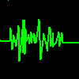

# Speech Recognition (comparison)

By: microcontrolled

Language: Spin

Created: Apr 16, 2013

Modified: April 16, 2013

This program receives voice through the "RecordBase" PUB and then you can record through the "WaitForCommand" PUB and compare it with the previously recorded sample. This object can get it right 50% of the time. Since the command will only work with your (the recorders) voice this is more ideal for security programs then ones needing spoken commands. Mic in circuit is equivalent that of the one on the demo board. Thanks to Jeff Ledger and Raymond Allen for the objects they made that this is based off of.
