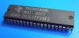

# Spin object to drive TMS9918A (or compatible) Video Display Processor

By: Zoltan Pekic

Language: Spin

Created: Jun 4, 2017

Modified: September 7, 2017

This zip contains 2 files:

TMS9918.spin

\-----------------------------------------------------------------------------------------------

Object to interface with TMS9918/19/28/29 Video Display Processor (or F18A FPGA implementation)

\-----------------------------------------------------------------------------------------------

Author: zpekic@hotmail.com (use freely, but give credit, that's what it boils down to)

\-----------------------------------------------------------------------------------------------

This object was developed based on following documentation:

https://github.com/cbmeeks/TMS9918

http://codehackcreate.com/archives/30

\-----------------------------------------------------------------------------------------------

It has been tested on F18A, but not real TMS99x8/9 family. In order to work on retro-hardware,

modifications may be needed, most notably delays in the read/update/write cycle (consuming the

line scan interrupt to make the changes only during scan times outside of visible area. F18A

has much higher memory bandwith and no such limitations.

\----------------------------------------------------------------------------------------------

Version         Date            Notes

\----------------------------------------------------------------------------------------------

0.91            2017-07-04      Added basic sprite support, and flags to turn on/off interrupt

                                wait and console logging. GRAPHICS2 mode still blows up... :-(

0.90            2017-06-03      Basic text and graphics primities, no sprites. GRAPHICS2 mode

                                still has a bug that is causing random scrambling of the display

                                after some number of drawing operations are executed      

\----------------------------------------------------------------------------------------------

See demo video here: https://www.youtube.com/watch?v=FW8V7gS8\_GI

\----------------------------------------------------------------------------------------------

TMS9918\_test.spin

This is a "main" program that exercised the functionality of the object in TMS9918. It is doing that by going through

a demo of 4 video modes and for each uses commands in order to draw and move text and graphics, as well as some basic sprite "animation".

I hope somebody finds these useful, and if you have suggestions or fixes, please let me know! I am especially interested in somebody

trying it out on real TMS99X8 chips (I developed these on F18A)

Thanks,

Z.
