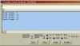

# Stack Length 2

By: Grant Gysbers

Language: Spin

Created: Apr 1, 2015

Modified: April 1, 2015

                      window while each line now ends with a "NL," New Line.  Useful in testing multiple process
                      flow paths of a cog's work order.

Desc formatted properly in SPIN code.

                  Eg.   +------------------------------------+
                        |Parallax Serial Terminal - (COMx)   |
                        +------------------------------------+
                        |                                    |
                        +------------------------------------+
                        |Stack Usage: 8                      |
                        |Stack Usage: 9                      |
                        |Stack Usage: 9                      |
                        |Stack Usage: 13                     |
                        |Stack Usage: 14                     |
                        |Stack Usage: 14                     |
                        |Stack Usage: 15                     |
                        |                                    |
                        +------------------------------------+

                   One's top level SPIN code may look similar to the following:
                                        
   VAR
     long TestStack[32]                    'a stack of longs used by delay routine    
   
   OBJ
     Stk   :       "Stack Length 2"        'Include Stack Length Object
  
   PUB public_method_name

     Stk.Init(@TestStack, 32)              'Initialize reserved Stack space (utilized below)

     cognew(Toggle(16, 3_000_000, 10), @TestStack)
     waitcnt(clkfreq * 6 + cnt)             'Pause 6 seconds
     Stk.GetLength(30, 9600)                'Transmit results serially out P30 at 9600 baud

     cognew(Toggle(2, 19_000_000, 11), @TestStack)
     waitcnt(clkfreq * 10 + cnt)            'Wait ample time for max stack usage, 10 seconds
     Stk.GetLength(30, 9600)                'Transmit results serially out P30 at 9600 baud

     cognew(Toggle(81, 2_000_000, 500), @TestStack)
     waitcnt(clkfreq * 10 + cnt)            'Wait ample time for max stack usage
     Stk.GetLength(30, 9600)                'Transmit results serially out P30 at 9600 baud

   PRI Toggle(x, y, z)
     ...     
