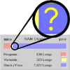

# Stack Length

By: Jeff Martin

Language: Spin

Created: Nov 27, 2006

Modified: May 2, 2013

Measures utilization of user-defined stack. This can be used to determine actual run-time stack requirements for an object in development.

Revision Notes:   
v1.1 - Updated to enhance GetLength's BaudRate range to interface with the Parallax Serial Terminal at its default baud rate.
