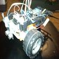

# StepperBotDriver2

By: Prophead100

Language: Spin

Created: Apr 16, 2013

Modified: May 3, 2013

This Object is designed to allow an easy method to run a stepper motor based robot. It launches a control method for each motor in an independent cog. The main code commands the motors by updating parameters of speed, distance, direction distance to the target, and brakes. The motor updates the main code and allows coordination by passing parameters back of remaining distance, remaining distance to target and motor in motion. The main code using a control loop to read sensors, determine status, define needed action and coordinate commands between motors.

The first demo is a Line Finding/Following Program Via Infrared Sensors with Collision Avoidance via a Ping Sensor and Sound Effects via a SoundPal Using Propeller Board of Education, 28BYJ48-12-300 Motor, ULN2003 Motor Controller, SoundPal, ROHM RPR-359 Reflective Infrared Sensors, Ping Sensor, 9.6 V Rechargable, Foam Rollers(for Feed Motor), Toy Wheels and Homemade Chassis. The second demo shows the versatility of the motor control with turning maneuvers. Each step is 5.626 degrees / 64 (gear reduction) or 0.087890625 degrees. The coils are energized in 8 steps or 0.703125 degrees (8\*0.087890625 degrees.)Each revolution is 360 degrees/0.087890625 degrees/rev or 4096 steps or 512 8-steps cycles. This code can use a 4 step coil sequence which is slightly faster with less torque by skipping 1/2 steps.

This was updated 5/1/13. This changed from ratios to percentages between wheels for steering and adds the ability to change the stepper motor sequence (full, half and wave steps) on the fly to optimize for speed, efficiency, precision and torque turns.
