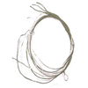

# String Library

By: Kwabena W. Agyeman

Language: Spin

Created: Oct 24, 2009

Modified: May 2, 2013

A string library. The code has been fully optimized with a super simple spin interface for maximum speed and is also fully commented.

Provides full support for:

*   Building strings from characters,
*   Accesseing built strings from characters,
*   Comparing strings case sensitively,
*   Comparing strings case insensitively,
*   Preforming string copying,
*   Preforming string concatenation,
*   Converting strings to uppercase,
*   Converting strings to lowercase,
*   Triming white space from strings,
*   Tokenizing strings with white space,
*   Finding characters in strings,
*   Finding strings in strings,
*   Replacing characters in strings,
*   Replacing strings in strings,
*   Converting a number to a decimal string,
*   Converting a decimal string to a number,
*   Converting a number to a hexadecimal string,
*   Converting a hexidecimal string to a number,
*   Converting a number to a binary string,
*   Converting a binary string to a number,
