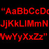

# Strings Library

By: Brandon Nimon

Language: Spin Spin

Created: Aug 27, 2009

Modified: August 20, 2013

A faster version can be found here: http://obex.parallax.com/object/582/ some precautions must be taken to change from v1.X to 2.X.

Strings Library:  
Contains 13 string-affecting methods. Methods include StrToLower, StrToUpper, SubStr, StrParse, StrStr, StrPos, StrReplace, Combine, StrRev, Trim, StrPad, Capitalize, and StrRepeat. Some are similar in functionality to PHP's string functions by the same name.

Updated demo by: Stefan Ludwig
