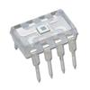

# TSL230 driver and demo

By: Paul Baker (Parallax)

Language: Spin, Assembly

Created: Apr 17, 2013

Modified: April 17, 2013

This object provides two drivers for the Taos TSL230R Light to Frequency sensor, a simple spin based driver and an auto-ranging assembly driver.
