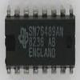

# Texas Instruments SN76489 emulator

By: Francesco de Simone

Language: Spin, Assembly

Created: Apr 17, 2013

Modified: April 17, 2013

This archive contains the driver for the Programmable Sound Generator by Texas Instruments SN76489. This chip was used in the eighties as sound chip for many arcade games and game console. The version of the driver included is updated to be used together with ZiCOG ans qZ80 emulators.

The code is written in Propeller assembly and has been reduced and optimized to take only 142 longs of program memory and 16 longs of shared memory for its registers. The driver, once started, listens to the io\_port location set for the Z80 emulation. As soon as it finds the number of its port ( in this case $7F ) it processes the data byte carried on the location of the io\_port.

It can be used also alone by accessing it as if it was the z80 doing it. The driver is well commented and with the demos included you can play some VGM music and also some sound effects.
