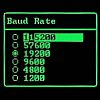

# Text based GUI for VGA_HiRes_Text Driver (revised)

By: allen marincak

Language: Spin

Created: Apr 17, 2013

Modified: May 20, 2013

Simple text based GUI elements for the VGA\_HiRes\_Text driver supporting mouse and keyboard input. Nothing fancy but some fundamental items to control and display feedback for your Prop Application. This is simple enough so that you can build on it yourself as needed. Included are 8 objects

*   text panes, menus, status lamps, spin buttons
*   input fields with selectable keyboard focus
*   check boxes, radio buttons, push buttons

Bug reports and suggestions are welcome.

The revised version (1.2) has a few bug fixes and an improved infrastructure that handles all of the UI management (that the user had to write in the previous version). This simplifies the use of the UI greatly and the user only has to create the elements and any action functions that the elements will trigger.

