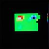

# Thermal Imager Demo (ZyTemp / VGA)

By: DogP

Language: Spin

Created: Apr 17, 2013

Modified: April 17, 2013

This demo combines reading temperatures with a ZyTemp (http://www.zytemp.com/) infrared thermometer with a VGA  
bitmap display, creating a thermal raster image. The image must be manually scanned, and with readings at a  
rate of about 1.4Hz, it can take a while to create a full image. This was tested with a ZyTemp TN203 (6:1  
distance to spot, plus laser), rebranded as CEN-TECH #93984 from Harbor Freight. It should work with any ZyTemp  
Infrared Thermometer which communicates using the same protocol (such as the commonly found TN105i2).

These modules communicate using an SPI-like protocol. The thermometer must be the Master though, so I modified  
the SPI engine to support Slave operation (and included it with this demo). The pins are accessible by opening  
the case of the thermometer. There's a 0.1" header at the bottom of the PCB with labels.

The pins are labeled:

*   A: Action
*   G: Ground
*   C: Clock 
*   D: Data
*   V: Vdd

This demo connects Clock to P0, Data to P1, Action to P2, and of course Ground to Vss.

To start an image, press and hold the Scan button and begin moving the thermometer horizontally at a steady pace.  
As temperature readings are read, a white square corresponding to the current pixel is drawn. After scanning a  
line of the image, let go of the button. Press and hold again to begin scanning the next line. Repeat this until  
you have the entire image scanned (maximum of 64 horizontal pixels by 48 vertical pixels). When you're done,  
single-click the Scan button. This will draw the image to the screen, auto-scaling the image size and colors  
corresponding to the temperatures in the image. A scale is drawn on the side to show the colors for relative  
temperatures. The serial port is also used to output debug messages, such as each temperature read, and at the  
end of the image, min/max temp and image size/scale.

The image quality depends mostly on how steady the image is scanned, as well as distance to spot ratio of the  
thermometer and the distance to the object being scanned. Mounting the thermometer on an XY track controlled by  
the Propeller would probably create the best image. If you want software control of the Scan button, you can pull  
the Action pin down on the Propeller.

This demo is based on my ZyTemp IR Thermometer Demo (based on Beau Schwabe's SPI Spin Demo), as well as Andy  
Schenk's VGA 128x96 Bitmap Demo. For more details on the ZyTemp thermometer, see the ZyTemp demo. This imager  
could also be modified to work with other IR thermometers, such as All Sun (which I've also written a demo for),  
or for the Melexis module, available from Parallax.

See forum post for more info/pics: http://forums.parallax.com/forums/default.aspx?f=25&m=453986 .
