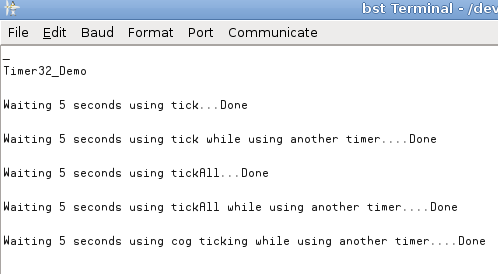

# Timer32

By: jmspaggi

Language: Spin

Created: Oct 6, 2010

Modified: May 2, 2013

VERY simple 32 bits timer providing non-blocking timeout methods.

Many options available. One timer, many timers, cog ticking the timer for you, etc.

Allow delays up to 145h, and as low as 200us. Can run at 80Mhz as well as any other frequency (refer to the code).

Documented, and including a demo. Based on the Javelin Timer class.

