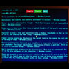

# VGA 1600x1200 Tile Driver w/Cursor

By: Chip Gracey (Parallax)

Language: Spin, Assembly

Created: Apr 17, 2013

Modified: April 17, 2013

This object generates a 1600x1200 VGA display from a 100x75 array of 16x16-pixel 4-color tiles.

It requires six cogs (or seven with optional cursor enabled) and at least 80 MHz.
