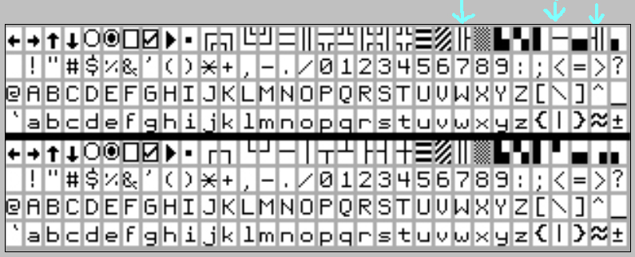

# VGA HiRes Font Pack - Onkyo's VFD Font w/ Single/Double Box Drawing.

By: Grant Gysbers

Language: Spin

Created: Oct 29, 2014

Modified: December 13, 2014

Onesys drop in copy & paste font pack for Parallax's VGA High-Res Text Driver.  Modeled after Onkyo's VFD font featured on their high end audio equipment.

Font pack supports either double or single lined box drawings.  The double lined font has three additional characters for dividing a box w/ a single horizontal line.  The tilde character, "~" has been changed to the aproximate symbol as in 3.9bar is aprox 4. (AKA "≈")

Includes code to switch between three fonts on the fly in real time, memory permitting.  
  
The font does beautifully at 640x480 & 800x600 yet cannot hold integrity at 1024x768.  Alternative Monitor timings referenced under CON.  
 

\======================

121314, updated/further smoothed out font, see additional text file and ref new jpg.  g

