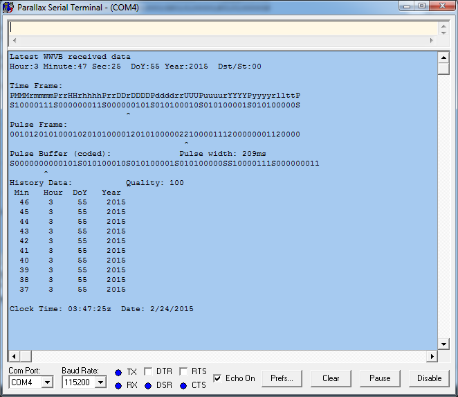

# WWVB NIST Time Signal Decoder

By: Steve Stuart

Language: Spin

Created: Feb 24, 2015

Modified: February 16, 2019

Here is a decoder for the time signals sent from station WWVB on 60 kHz radio frequency.

The object includes a standard time keeping clock using the Parallax Propeller's crystal as a time base. The clock is updated by the time data received from the WWVB station when decoding is successful.

Requires a radio receiver such as the module available from (as of Feb 2019):

*   https://www.amazon.com/CANADUINO-60kHz-Atomic-Clock-Receiver/dp/B01KH3VEGS
*   https://universal-solder.ca/product/wwvb-msf-jjy60-atomic-clock-receiver-module-60khz/

Data sheet for C-MAX CMMR-6

Video of running demo:

*   http://youtu.be/ETOKIrwbhDU
*   http://youtu.be/xOaToQSoQJU

