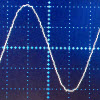
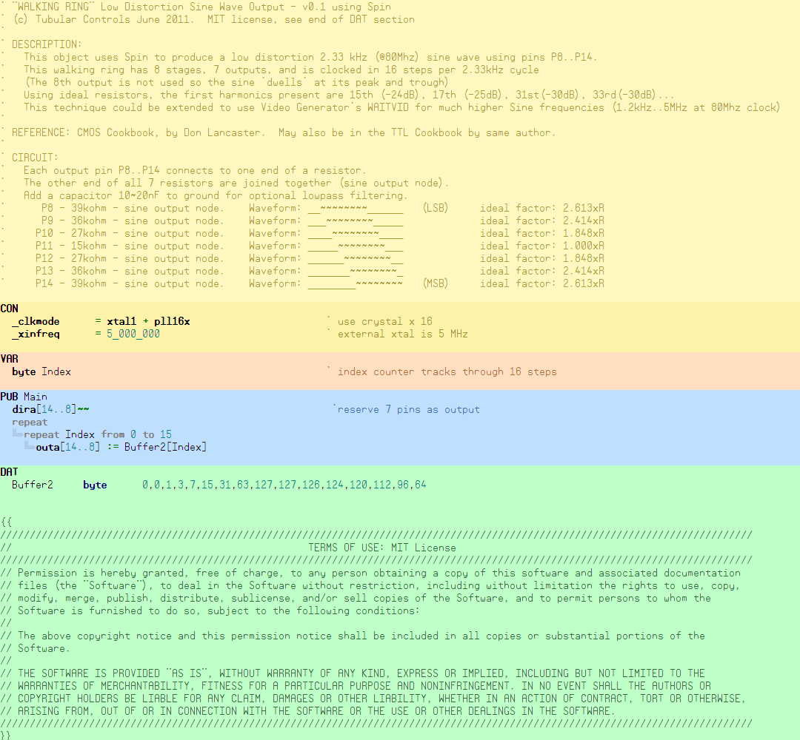

# Walking Ring Sine Generators

By: tubular

Language: Spin

Created: Apr 17, 2013

Modified: April 17, 2013

Uses 7 pins to generate a low distortion analog Sine Wave using the "Walking Ring" method.

