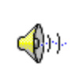

# Wav Players

By: Raymond Allen

Language: Spin, Assembly

Created: Apr 17, 2013

Modified: April 17, 2013

Three types of Windows Wav file players. One has an assembly component and can play high quality 16-bit stereo wav files. The other two are all in SPIN. One plays 16-bit mono up to 16 kHz. The other plays 8-bit mono at 8 kHz.
