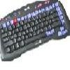

# WebTV Keyboard Object

By: Jeff Ledger

Language: Spin

Created: Apr 17, 2013

Modified: April 17, 2013

This WebTV keyboard driver provides an easy method of adding an IR keyboard which is mostly Combokeyboard compatible.

Tested with the RCA UltimateTV Universal Wireless Keyboard. Not extremely fast, but easy and simple. Object driver written by "localroger" and demo by "oldbitcollector"

RCA UltimateTV Keyoard: WKB10WN1

Object was updated to remove the Philips IR keyboard support which was causing serious compatibility problems with the RCA unit.
