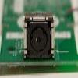

# Wiimote IR blob tracking camera

By: Graham Stabler

Language: Spin, Assembly

Created: Apr 17, 2013

Modified: May 20, 2013

The Nintendo Wii's controller called the Wiimote contains a small IR camera with I2C interface. This camera can track the position of 4 points of light (IR if filter is used, visible if removed.) This can be used for many applications such as 3D scanning, head tracking, multi-touch screens, robot targeting, range finding. The object runs in a cog and can be used using simple helper functions, there are several demos and the main object is well documented. All you need for hardware is the wiimote camera and a pull up resisitor.

See a demo at: http://www.youtube.com/watch?v=TOoXNzTXhe4
