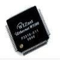

# Wiznet W5100 Indirect/Parallel Driver

By: Timothy D. Swieter

Language: Spin, Assembly

Created: Apr 17, 2013

Modified: April 17, 2013

An ASM driver for communicating with the Wiznet W5100 Ethernet IC using Indirect/Parallel. This driver launches a COG that handles FAST reading and writing to the W5100. There are routines in both ASM and SPIN for establishing communication and transferring data and settings. See the file for further instructions on usage.

DEMO: Look on the right of the screen under the Auxiliary files to see a couple demos. Included are UDP, TCP Server, TCP Client demo and a hard coded web page serving demo. These demos are very simple in nature to illustrate the core portions of the W5100 driver. You may need to update the Object portion of the demo code to point to the latest version of the object.

Version Log:

*   0.5 - initial release on OBEX
*   0.6 - added a couple more routines for accessing the W5100. Fixed the UDP buffer problem, made the driver use the SPI Enable pin on the W5100.
*   0.7 - updated the code for various bugs posted to the forum.

Please note that the most up-to-date code may be available via Google Code:

http://code.google.com/p/spinneret-web-server/

http://spinneret-web-server.googlecode.com/svn/trunk/W5100\_Indirect\_Driver.spin

