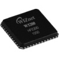

# Wiznet W5200 Driver

By: Benjamin Yaroch

Language: Spin, Assembly

Created: Apr 17, 2013

Modified: April 17, 2016

A driver for communicating with the Wiznet iEthernet W5200 Fast SPI Ethernet Controller IC. This driver launches into its own COG then reads and writes to the W5200. Routines are written in both ASM and SPIN to establish communication, transfer data, and change settings.

Included in the zip is a demo to show how to use the driver. The Propeller will offer up a webpage when the IP address is entered into a web browser.
