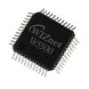

# Wiznet W5500 Driver

By: Benjamin Yaroch

Language: Spin, Assembly

Created: Apr 17, 2016

Modified: April 21, 2016

A driver for communicating with the Wiznet W5500 SPI Ethernet Controller IC. This driver launches into its own COG then reads and writes to the W5500. Routines are written in both ASM and SPIN to establish communication, transfer data, and change settings. This is a direct port from the W5200\_Driver: http://obex.parallax.com/object/658

Included in the zip is a demo to show how to use the driver. The Propeller will offer up a webpage when the IP address is entered into a web browser.
