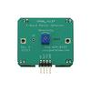

# X Band Motion Detector

By: Joshua Donleson (parallax)

Language: Spin

Created: Apr 17, 2013

Modified: April 17, 2013

This is an object that can read the number of cycles that the X Band Sensor outputs in relations to motion, and displays on the Parallax Serial Terminal.
