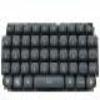

# Xbox 360 Chatpad 'Keyboard' Object

By: Greg Porter

Language: Spin, Assembly

Created: Apr 17, 2013

Modified: April 17, 2013

This demo interfaces the Propeller to the 'Chatpad' keyboard accessory of an Xbox 360 remote control.

A start() method defines the two pins handling serial tx & rx to the Chatpad, while standard serial object methods like rxcheck() are used to detect keystrokes. Please see the comment section within the Chatpad object for electrical interfacing details. The Chatpad requires a 3.3v supply and is equipped with keystroke-triggered backlight illumination.

The 8-byte 'keycode' message transmitted by the Chatpad is decoded by a cog using several 'keycode' lookup tables within hub memory. Only decoded keystrokes are forwarded to the rx\_buffer for access via rxcheck(). Also, the cog automatically transmits a required 'stay awake' message every few seconds.

The character lookup tables may be modified as desired. I have tried to closely match table entries to the characters recognized by the Parallax Serial Terminal software whenever possible. The "orange", "green", "people", and "shift" keys are used to select alternative characters. I have chosen to use the "people" key to select some special operations recognized by the Parallax Serial Terminal like "clear screen", "clear below", "beep". The Backspace and Enter keys also function correctly within the Serial Terminal software environment.
