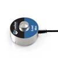

# iLoad Mini Demo

By: Oliver Theile

Language: Spin

Created: Apr 9, 2013

Modified: April 9, 2013

The iLoadMiniDemo Object demonstrates how to interface with and read the load/force/weight sensed by an iLoad Mini load sensor and display it on an LCD.
