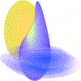

# sensirion_integer

By: Tracy Allen

Language: Spin

Created: Apr 16, 2013

Modified: April 16, 2013

Object and demo for the Sensirion SHT10, SHT11, SHT15, SHT71 and SHT75. This version uses all integer math, no floating point. A call to ReadTemperature returns the value in units of hundredths of a degree Celsius. ReadHumidity returns units of tenths of a percent RH. If the sensor times out, or if the reading is grossly out of range, the call returns negx.

Integer math is faster than FP, and this also avoids having to load the FP machinery if it is not otherwise required.

This is a no-frills driver and requires only the 2 pin numbers as Init parameters. It comes up assuming high resolution mode. It can be changed with a run-time command to low resolution mode, which is faster. There is a compile time constant for power supply voltage, if for example you want to run the sensor from 5V instead of default 3.3.

There are two demos. The first simply shows how to read the values and display them using Parallax Serial Terminal. A second demo shows how to change the resolution at run time, and how to turn on and off the heater (which is hardly ever useful in practice).It also shows the conversion times in milliseconds, so that you can assess the difference in speed between the modes.
