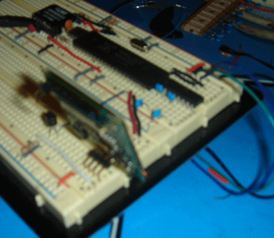
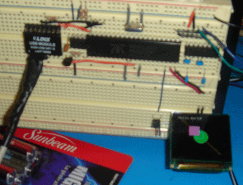

# uOLED-128 LCD Driver

By: Simon Ampleman

Language: Spin

Created: Apr 17, 2013

Modified: April 17, 2013

This is an object to control the uOLED-128 from dontronics. www.dontronics-shop.com - 128x128 pixels- 1.5 inch- Serial interface - 2 pins to interface tx rx- 65536 colors- LCD with Backlight or OLED no backlight required- From 30 to 80 US- 0 to 8 Megabyte flash memory This object will allow you to do every commands possible through the serial interface flash commands not yet implemented - Erase Screen- Draw Rectangle Line Circle Pixel Char Text- Copy block of pixel- Change Font Size- Change Contrast

