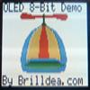

# uOLED-96-PROP 8-bit display & graphics driver

By: Timothy D. Swieter

Language: Spin, Assembly

Created: Apr 17, 2013

Modified: April 26, 2013

The enclosed programs include a demo and two drivers. The programs are for use with the uOLED-96-PROP by 4D Systems. The demo program demonstrates the use of the display driver (code that clocks Propeller memory to the OLED GRAM). The display driver is written in ASM and is very fast (6ms per screen update). The graphics driver (code the draws objects in the Propeller memory) is written in SPIN and is a collection of routines to draw lines, circles, sprites and text into the Propeller memory.

A video of the demo can be seen at: http://www.youtube.com/watch?v=l\_yzYST3xO8 or it can be downloaded in the right hand column, near the bottom.
