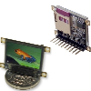

# uOled-96-Prop: Serial Interface

By: Raymond Allen

Language: Spin, Assembly

Created: Apr 17, 2013

Modified: April 17, 2013

Serial command interface and advanced driver for the uOled-96-Prop.   
This program gives the device a nearly identical serial interface as the µOLED-128-GMD1. You may want to also download the two auxillary files that contain a Windows test program for the serial interface and example files to be stored on the uSD card.

The main Spin file is "uOLED-96-Prop-RS232". It and all the supporting source files are in the zip file "uOLED-96-Prop-RS232.zip". Make this you top-level object in the Prop Tool and "Load EEPROM" to program the device with this object.

Once programmed and energized, the device takes a few ms to become ready. It then waits 5 seconds for a $55 (hex) character, which is used to auto-detect the baud rate (up to 57600). If this character is not detected, the device defaults to 115200 baud and Prop logo is displayed on the screen.

The V4 driver has been extended and partially converted to assembly to more quickly display text and images. Additional features include Windows Bitmap display from SD card, image display over serial, image display from raw data on SD card, slideshow display from preformatted data on SD card, "Print Screen" function to save screen to .bmp file on SD card, and much more...

A Windows application "OledInterface.exe" (in the WindowsInterface.zip file) is provided to test all commands. This application also allows one to import a variety of image formats to be either sent as serial image data, saved as .bmp files, or as raw data image files. Slideshow data can also be created using this tool.

Several sample images and slideshows to be stored on the SD card are provided in the "SDCard\_Files.zip" file. The binary form of FemtoBasic is also there as it can be invoked via serial command. A text file describes each file.

You may find the animations interesting... Assuming the file test4.dat is on the SD card, press the "Slideshow" button on the control app (after waiting for the Prop hat logo to appear on the oled and opening the serial port at 115200 baud). Enter "test4" or "test4.dat" in the filename box and press the OK button. The display should show an animation of a flying dove. Any serial byte sent stops the animation. So, you can stop it by, e.g., hitting the "Clear Screen" button.
