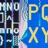

# uPD161704A TFT driver, SPI

By: MarkT

Language: Spin, Assembly

Created: Apr 17, 2013

Modified: April 17, 2013

A serial SPI-style driver for the uPD161704A LCD controller chip as in Waveshare's cheap 2.2" TFT module (available on eBay)

Simple graphics are provided, dot/line/rect/characters.

8-bit parallel interface is also planned as a separate object.
