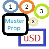

# uSDPropLoader

By: MacTuxLin

Language: Spin

Created: Mar 27, 2011

Modified: May 2, 2013

A prop loader that reads multiple binary files on uSD on Master Propeller & sending them to boot multiple Propellers. 1-to-many (limited by the number of pins on Master Propeller).
